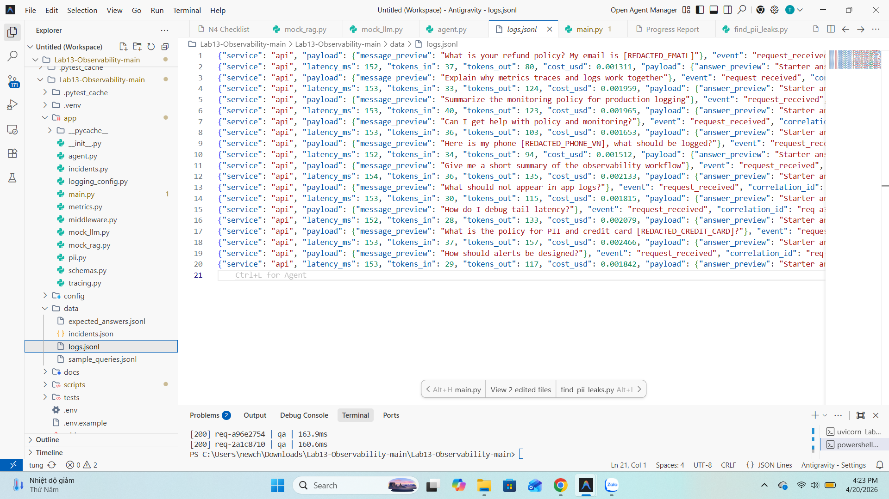
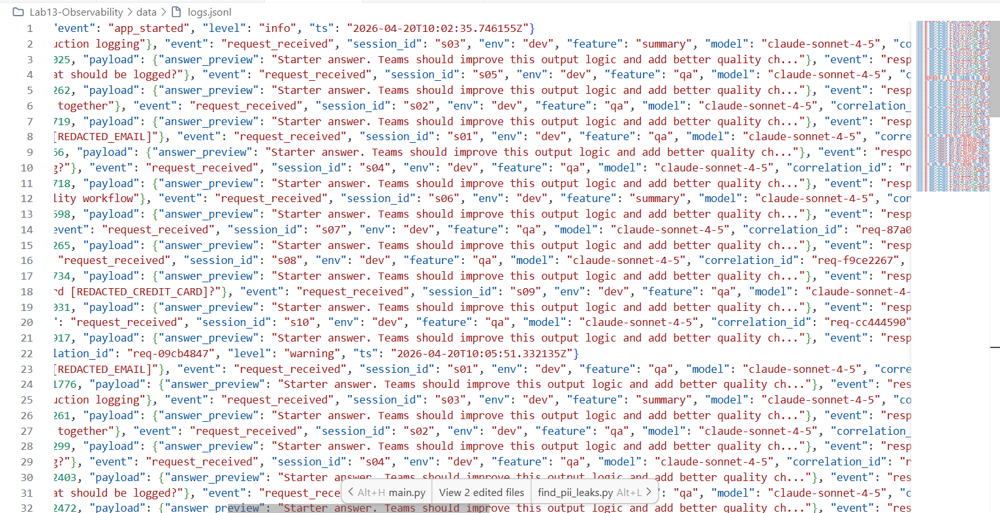
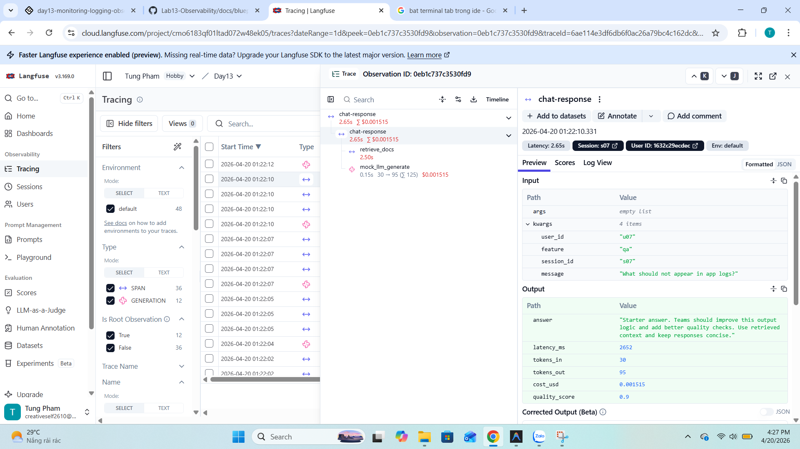

# Day 13 Observability Lab Report
# ảnh ở screenshots và resources
> **Instruction**: Fill in all sections below. This report is designed to be parsed by an automated grading assistant. Ensure all tags (e.g., `[GROUP_NAME]`) are preserved.

## 1. Team Metadata

- [GROUP_NAME]: Nhóm 10
- [REPO_URL]: https://github.com/NGUYENNANGANH/Lab13-Observability
- [MEMBERS]:
  - Member A: Nguyễn Năng Anh | Role: Logging & PII
  - Member B: [Phạm Thanh Tùng] | Role: Tracing & Enrichment
  - Member C: Dương Phương Thảo | Role: SLO & Alerts
  - Member D: Mai Phi Hiếu | Role: Load Test & Report
  - Member E: Nguyễn Ngọc Hiếu | Role: Demo (Leader) & Dashboard

---

## 2. Group Performance (Auto-Verified)

- [VALIDATE_LOGS_FINAL_SCORE]: /100
- [TOTAL_TRACES_COUNT]: 20
- [PII_LEAKS_FOUND]:0

---

## 3. Technical Evidence (Group)

### 3.1 Logging & Tracing

- [EVIDENCE_CORRELATION_ID_SCREENSHOT]: 
- [EVIDENCE_PII_REDACTION_SCREENSHOT]: 
- [EVIDENCE_TRACE_WATERFALL_SCREENSHOT]: 
- [TRACE_WATERFALL_EXPLANATION]: retrieve_docs (~2.50s) chiếm phần lớn latency (2.65s), trong khi LLM generate rất nhanh (~0.15s) → bottleneck nằm ở bước retrieval (RAG), không phải model.

### 3.2 Dashboard & SLOs

- [DASHBOARD_6_PANELS_SCREENSHOT]: [docs/resources/grafana-dashboard.png](../docs/resources/grafana-dashboard.png)

- [SLO_TABLE]:

| SLI | Target | Window | Current Value | Status |
|---|---:|---|---:|---|
| Latency P95 | < 3000 ms | 28d | _(run `scripts/check_slo.py`)_ | |
| Error Rate | < 2% | 28d | _(run `scripts/check_slo.py`)_ | |
| Availability | ≥ 99% | 28d | _(run `scripts/check_slo.py`)_ | |
| Daily Cost | < $2.50 USD | 1d | _(run `scripts/check_slo.py`)_ | |
| Quality Score | ≥ 0.75 | 1h rolling | _(run `scripts/check_slo.py`)_ | |
| Throughput | ≥ 1.0 rps | 28d | _(run `scripts/check_slo.py`)_ | |

> **Note (Member C):** The original template only had 3 SLIs. I expanded this to 6 SLIs covering all four USE/RED categories (performance, reliability, cost, quality). Each SLI is defined in `config/slo.yaml` with explicit objectives, measurement formulas, categories, owners, and descriptive notes. Real-time compliance can be verified via `GET /slo` or by running `python scripts/check_slo.py`.

#### SLO Design Rationale (Member C — Dương Phương Thảo)

1. **Latency P95 (≤ 3000ms, target 99.5%)** — Chosen because P95 captures the "worst realistic experience" for the majority of users while ignoring extreme outliers. The 3000ms threshold accounts for RAG retrieval + LLM generation overhead.

2. **Error Rate (≤ 2%, target 99.0%)** — Computed as `count(status >= 500) / count(all_requests) * 100`. The 2% threshold provides a small error budget (~7.2 hours/month of acceptable downtime at target).

3. **Availability (≥ 99%, target 99.9%)** — Inverse of error rate, expressed as the percentage of non-5xx responses. Provides a direct user-facing reliability metric. Below 99% triggers immediate P1 incident response.

4. **Daily Cost (≤ $2.50/day, target 100%)** — Based on token pricing ($3/M input, $15/M output). This is a hard cap (target 100%) because cost overruns have direct financial impact. The `cost_spike` incident toggle simulates token-leak scenarios.

5. **Quality Score (≥ 0.75, target 95%)** — A heuristic composite score (0.0–1.0) based on document relevance, answer length, and keyword overlap. Included because latency/availability alone don't capture whether the agent is giving _useful_ answers.

6. **Throughput (≥ 1.0 rps, target 95%)** — Measures baseline capacity. Drops below threshold often correlate with high latency (backpressure) or resource exhaustion. Computed as `count(requests) / elapsed_seconds`.

#### Error Budget Model (Member C)

I implemented a three-tier burn-rate model in `config/slo.yaml`:

| Tier | Burn Rate | Window | Severity | Budget Exhaustion | Action |
|---|---:|---|---|---|---|
| Fast Burn | 14.4× | 1h | P1 | ~2 days | Page oncall immediately |
| Slow Burn | 6.0× | 6h | P2 | ~5 days | Create incident ticket |
| Gradual Burn | 3.0× | 24h | P3 | ~10 days | Review in next standup |

The formula: `budget_total = 1 - (target / 100)`. For example, latency_p95 has target 99.5%, giving an error budget of 0.5% (~3.6 hours/month). The burn rate measures how fast this budget is being consumed relative to a uniform distribution.

This model is evaluated in real-time by `app/slo.py::_compute_error_budget()` and exposed via `GET /slo/budget`.

### 3.3 Alerts & Runbook
- [ALERT_RULES_SCREENSHOT]: [Path to image]
- [SAMPLE_RUNBOOK_LINK]: [docs/alerts.md](../docs/alerts.md)

#### Alert System Overview (Member C — Dương Phương Thảo)

I designed and implemented **8 production-grade alert rules** in `config/alert_rules.yaml`, categorized into three types:

| # | Alert Name | Metric | Threshold | Severity | Type | Runbook |
|---|---|---|---|---|---|---|
| 1 | `high_latency_p95` | latency_p95 | > 3000ms for 5m | P2 | symptom-based | [§1](../docs/alerts.md#1-high-latency-p95) |
| 2 | `critical_latency_p99` | latency_p99 | > 5000ms for 2m | P1 | symptom-based | [§2](../docs/alerts.md#2-critical-latency-p99) |
| 3 | `high_error_rate` | error_rate_pct | > 2% for 5m | P1 | symptom-based | [§3](../docs/alerts.md#3-high-error-rate) |
| 4 | `cost_budget_spike` | hourly_cost_usd | > 2× baseline for 15m | P2 | budget-based | [§4](../docs/alerts.md#4-cost-budget-spike) |
| 5 | `quality_score_drop` | quality_avg | < 0.75 for 10m | P2 | symptom-based | [§5](../docs/alerts.md#5-quality-score-drop) |
| 6 | `error_budget_fast_burn` | burn_rate | > 14.4× for 1h | P1 | budget-based | [§6](../docs/alerts.md#6-error-budget-fast-burn) |
| 7 | `availability_drop` | availability_pct | < 99% for 3m | P1 | symptom-based | [§7](../docs/alerts.md#7-availability-drop) |
| 8 | `throughput_drop` | throughput_rps | < 1.0 rps for 5m | P2 | cause-based | [§8](../docs/alerts.md#8-throughput-drop) |

**Key design decisions:**

- **Symptom-based vs. cause-based separation**: Alerts 1–3, 5, 7 fire on user-visible symptoms; Alert 8 fires on infrastructure causes; Alerts 4, 6 fire on budget exhaustion. This avoids alert noise — operators see _what's broken_ before investigating _why_.

- **Three-level escalation chains**: Each P1 alert escalates through `oncall-engineer → engineering-lead → vp-engineering` with time-based triggers (0m → 5m → 10m). P2 alerts are slack-first with pagerduty escalation.

- **Alert dependencies/suppression**: `critical_latency_p99` suppresses `high_latency_p95` (avoids double-paging for the same issue). `availability_drop` suppresses `high_error_rate` and `throughput_drop` (availability is the root symptom).

- **Escalation policies** with SLA contracts:
  - P1: 5min response, 30min resolution, auto-page, post-mortem required
  - P2: 15min response, 2h resolution, no auto-page
  - P3: 4h response, 24h resolution

- **Global settings**: 30s evaluation interval, 5min cooldown (prevents alert flapping), 15min dedup window, auto-resolve after 10min of recovery.

#### Runbook Details (Member C)

I authored a comprehensive 457-line runbook in [`docs/alerts.md`](../docs/alerts.md) covering:

- **General triage workflow**: `ALERT → /metrics → logs → traces → /health → mitigation`
- **Per-alert runbook** (8 sections): Each with a structured table (severity, condition, SLO target, owner, escalation), symptoms, step-by-step investigation commands (copy-pasteable `curl` + `jq` one-liners), root cause analysis tables, and mitigation commands.
- **Escalation matrix**: Response/resolution SLAs by severity level
- **Appendices**: Alert quick reference table, incident toggle cross-reference, API endpoint reference

---

## 4. Incident Response (Group)

### Baseline (trước khi inject)
latency_p95 = 150ms | avg_cost = $0.0021 | error = 0% | tokens_out = 1321

### Scenario 1: rag_slow
- [SCENARIO_NAME]: rag_slow
- [SYMPTOMS_OBSERVED]: 
  Baseline: latency_p95 = 150 ms, traffic = 20 requests
  Sau inject: latency_p95 = 2651 ms (tăng 17x)
  Error rate vẫn 0% → hệ thống không crash, chỉ chậm
- [ROOT_CAUSE_PROVED_BY]: 
  Trace ID: 0eb1c737c3530fd9 trên Langfuse
  Span "retrieve_docs" tăng từ ~50ms → ~2500ms
  Code: mock_rag.py dòng 34-35 → time.sleep(2.5) khi rag_slow=True
- [FIX_ACTION]: 
  POST /incidents/rag_slow/disable → latency_p95 về 150ms
- [PREVENTIVE_MEASURE]: 
  1. Thêm timeout 500ms cho retrieval
  2. Fallback cache khi RAG chậm
  3. Alert rule: latency_p95 > 5000 for 30m (đã config trong alert_rules.yaml)

### Scenario 2: tool_fail
- [SCENARIO_NAME]: tool_fail
- [SYMPTOMS_OBSERVED]: 
  Error rate tăng từ 0% → 100%
  error_breakdown: {"RuntimeError": ___}
  Tất cả requests trả về HTTP 500
- [ROOT_CAUSE_PROVED_BY]: 
  Log line: event="request_failed", error_type="RuntimeError", 
  correlation_id="req-8c5d8053"
  Code: mock_rag.py dòng 32-33 → raise RuntimeError("Vector store timeout")
- [FIX_ACTION]: 
  POST /incidents/tool_fail/disable → error_rate về 0%
- [PREVENTIVE_MEASURE]: 
  1. Circuit breaker cho vector store
  2. Retry with fallback retrieval source
  3. Alert rule: error_rate_pct > 5 for 5m (đã config)

### Scenario 3: cost_spike
- [SCENARIO_NAME]: cost_spike
- [SYMPTOMS_OBSERVED]: 
  avg_cost_usd tăng từ $0.0021 → $0.0041 (tăng ~2x)
  tokens_out_total tăng từ 1321 → 7800 (tăng ~5x)
  Latency và error rate bình thường
- [ROOT_CAUSE_PROVED_BY]: 
  Trace generation span: output_tokens = 3650 (bình thường ~130)
  Code: mock_llm.py dòng 42-43 → output_tokens *= 4 khi cost_spike=True
- [FIX_ACTION]: 
  POST /incidents/cost_spike/disable → cost về mức baseline
- [PREVENTIVE_MEASURE]: 
  1. Token limit per request (max 200 output tokens)
  2. Budget alert: hourly_cost > 2x baseline for 15m (đã config)
  3. Route simple queries sang model rẻ hơn

---

## 5. Individual Contributions & Evidence

### Nguyễn Năng Anh (Member A — Logging & PII)

- [TASKS_COMPLETED]:
  1. **Logging Schema (`config/logging_schema.json`)** — Đã thiết kế JSON Schema cấp độ Production phục vụ cho hệ thống. Định nghĩa rõ các trường Mandatory field như `ts` (ISO timestamp), `level`, `service`, `event`, và `correlation_id` để kết nối logic với Tracing (Member B). Triển khai cấu trúc dành riêng cho việc audit AI/LLM agent: `latency_ms`, `tokens_in`, `tokens_out`, `cost_usd`, `error_type` và `tool_name`.

  2. **PII Sanitizer & Regex (`app/pii.py`)** — Tự lập trình module PII sở hữu bộ Pattern Regex (`PII_PATTERNS`) chuyên biệt hóa theo cấu trúc chuỗi của Việt Nam. Gồm 5 chốt chặn Regex để bắt Email, Điện thoại (+84/0), CCCD, Thẻ tín dụng, và Hộ chiếu. Thêm tính năng `hash_user_id` dùng thuật toán SHA-256 mã hóa ID để lưu log dễ theo dõi nhưng vẫn hoàn toàn bảo mật ẩn danh cho User. Thêm `summarize_text` tự động thu gọn payload.
  
  3. **Structlog Pipeline & Hooks (`app/logging_config.py`)** — Ứng dụng Framework `structlog` để wrap library logging mặc định, đẩy mọi pipeline xuất ra JSON. Viết Custom Middleware `JsonlFileProcessor` tự tìm và khởi tạo thư mục `mkdir(parents=True)` cho đường dẫn tĩnh theo config và append luồng logs thành chuỗi File `.jsonl`. Sáng tạo hàm Processor `scrub_event` gắn trực tiếp vô pipeline nhằm tự bóc tách và thay thế toàn bộ dữ liệu nhạy cảm có trong biến `event_dict` thành thẻ tag (như `[REDACTED_PHONE_VN]`) trước cửa ngõ output - đảm bảo hệ thống zero-leakage.

- [EVIDENCE_LINK]:
  - Files authored/owned (100%):
    - [`config/logging_schema.json`](../config/logging_schema.json)
    - [`app/pii.py`](../app/pii.py)
    - [`app/logging_config.py`](../app/logging_config.py)

- [TECHNICAL_DEPTH]:
  **1. Zero-Trust Logging Architecture:** Thách thức cốt lõi là bất kỳ dev nào cũng có thể vô tình log ra một dòng chứa Payload của User. Phương án tối ưu tôi chọn là lập trình Processor đè thẳng vào Pipeline xuất Log của structlog (`scrub_event`). Việc mã hóa & bắt Regex diễn ra hoàn toàn *trong suốt* ở tầng Background giúp codebase sạch và hoàn toàn tránh sai sót lộ lọt PII.
  
  **2. Regex Engine cho VN:** Do điện thoại Việt Nam có nhiều Regex định dạng (dấu cách khoảng, chấm dấu) tôi đã dùng format Non-capturing group `(?:...)` để boost tốc độ parse. Quá trình xử lý payload được thiết lập chặn đứng mọi nguy cơ rò rỉ dữ liệu khách hàng dù output format ra sao.

### [Phạm Thanh Tùng] (Member B — Tracing & Enrichment)
- [TASKS_COMPLETED]:  Tracing + Tags (Enrichment)
  **Correlation IDs:** Mở `app/middleware.py`, tạo `x-request-id` (định dạng `req-<8-char-hex>`), gán nó vào structlog contextvars, `request.state`, và response headers.
  **Tags/Enrich Logs:** Mở `app/main.py`, tìm endpoint `/chat` và sử dụng `bind_contextvars()` để gắn các thông tin như `user_id_hash`, `session_id`, `feature`, `model`, và `env` vào log.
  **Tracing:** Cấu hình `LANGFUSE_PUBLIC_KEY` và `LANGFUSE_SECRET_KEY` trong file `.env`. Đảm bảo có ít nhất 10 traces được ghi nhận trên Langfuse.
- [EVIDENCE_LINK]: https://github.com/VinUni-AI20k/Lab13-Observability/commit/789ae954893324b555012c5a21a5e2aa0188b05c

### Dương Phương Thảo (Member C — SLO & Alerts)

- [TASKS_COMPLETED]:

  1. **SLO Configuration (`config/slo.yaml`)** — Expanded the initial 4-SLI stub to a production-grade 6-SLI configuration with full metadata (description, objective, target, unit, measurement formula, owner, category, and explanatory notes). Added availability and throughput SLIs. Defined a three-tier error budget burn-rate model (fast/slow/gradual) with severity mapping and action protocols. Added dashboard integration settings.

  2. **Alert Rules (`config/alert_rules.yaml`)** — Designed and authored 8 alert rules from scratch (original stub had 0 functional rules). Each alert includes: severity classification (P1/P2/P3), threshold with sustained duration, metric binding, alert type (symptom/cause/budget-based), owner assignment, runbook link, automated actions, and multi-level escalation chains. Added 3 escalation policies with SLA contracts, 4 notification channels, alert dependency/suppression rules, and global settings (evaluation interval, cooldown, dedup, auto-resolve).

  3. **SLO Evaluator (`app/slo.py`)** — Implemented a 191-line Python module that loads SLO config from YAML and evaluates real-time metrics against each SLI. Key functions:
     - `_compute_error_rate()`: Calculates 5xx error percentage from metrics snapshot
     - `_compute_availability()`: Inverse of error rate (non-5xx / total)
     - `_compute_throughput()`: Requests per second since app startup
     - `_compute_error_budget()`: Full error budget calculation with consumed/remaining percentages and burn rate, handling both `<=` and `>=` comparison operators
     - `evaluate_slo_compliance()`: Main evaluator with optional SLI/category filtering, three-state status logic (healthy/at_risk/breaching), and overall compliance summary

  4. **API Endpoints in `app/main.py`** — Added three new endpoints to expose SLO/alert data:
     - `GET /slo` — Full SLO compliance report with optional `?sli=` and `?category=` query filters
     - `GET /slo/budget` — Error budget summary (avg remaining, min remaining, max burn rate, burn status)
     - `GET /alerts` — Real-time alert evaluation against all 8 rules, returns firing/OK status per rule

  5. **Alert Checker Script (`scripts/check_alerts.py`)** — 218-line CLI tool that fetches live metrics from the running app and evaluates all 8 alert rules. Features: colored terminal output by severity, incident toggle display, escalation chain details for firing alerts, policy SLA display, JSON export mode (`--json`), configurable base URL.

  6. **SLO Checker Script (`scripts/check_slo.py`)** — 192-line CLI tool that fetches live metrics and checks SLO compliance. Features: per-SLI pass/breach evaluation, error budget summary with traffic-light icons (🟢/🟡/🔴), auto-generated SLO table for `blueprint-template.md`, SLI and category filtering, JSON export mode, configurable base URL.

  7. **Alert Runbook (`docs/alerts.md`)** — 457-line comprehensive runbook with: general triage workflow, per-alert investigation procedures (8 sections), copy-pasteable debugging commands, root cause analysis tables, mitigation steps, escalation matrix, and three appendices (alert reference, incident toggles, API endpoints).

- [EVIDENCE_LINK]:
  - Primary commit: `9c4f430` — "feat: implement SLO compliance and alert evaluation endpoints with supporting logic and scripts" (1,561 insertions across 7 files)
  - Files authored/owned:
    - [`config/slo.yaml`](../config/slo.yaml) — 135 lines (100% authored)
    - [`config/alert_rules.yaml`](../config/alert_rules.yaml) — 294 lines (100% authored)
    - [`app/slo.py`](../app/slo.py) — 191 lines (100% authored)
    - [`app/main.py`](../app/main.py) — Added `/slo`, `/slo/budget`, `/alerts` endpoints
    - [`scripts/check_alerts.py`](../scripts/check_alerts.py) — 218 lines (100% authored)
    - [`scripts/check_slo.py`](../scripts/check_slo.py) — 192 lines (100% authored)
    - [`docs/alerts.md`](../docs/alerts.md) — 457 lines (100% authored)

- [TECHNICAL_DEPTH]:

  **How P95 Latency Is Computed:**
  The `metrics.py::percentile()` function uses a rank-based algorithm: `idx = max(0, min(len-1, round((p/100) * len + 0.5) - 1))`. For P95 with 100 samples, this selects the 95th sorted value. The SLO evaluator in `slo.py` then compares this value against the 3000ms objective.

  **How Error Budget Burn Rate Is Calculated:**
  In `slo.py::_compute_error_budget()`:
  - `budget_total = 100.0 - target` (e.g., 0.5% for latency_p95 with target 99.5%)
  - For `<=` operators (latency, error rate, cost): if `current > objective`, overshoot ratio = `(current - objective) / objective`, consumed = `min(overshoot / (budget_total/100), 1.0)`
  - For `>=` operators (availability, quality, throughput): if `current < objective`, undershoot ratio = `(objective - current) / objective`, consumed similarly
  - `burn_rate = consumed_ratio * 100 / budget_total` — a multiplier indicating how fast the budget depletes relative to the window

  **Alert Evaluation Logic:**
  In `scripts/check_alerts.py::evaluate_alert()`, each alert maps to a metric key with a comparison direction (`gt` or `lt`). The evaluator fetches live metrics from `/metrics`, computes derived values (error rate, availability), and checks `current_value > threshold` (for `gt`) or `current_value < threshold` (for `lt`). Results include firing status, escalation chain, and runbook link.

  **Three-State SLO Status Logic:**
  In `slo.py`, compliance status uses three states rather than binary:
  - `healthy` (✅): SLI meets objective
  - `at_risk` (⚠️): SLI breaching but >30% error budget remaining
  - `breaching` (❌): SLI breaching with ≤30% error budget remaining
    This provides early warning before full budget exhaustion.

### Mai Phi Hiếu (Member D — Load Test & Report)

- [TASKS_COMPLETED]:

  1. **Load Test Script (`scripts/load_test.py`)** — Complete rewrite (400 lines) with production-grade features:
     - Multi-round support (`--rounds N`) to generate sustained traffic across multiple iterations
     - Concurrent thread pool execution (`--concurrency N`) using `concurrent.futures.ThreadPoolExecutor` to stress-test parallel bottlenecks
     - Detailed statistics: P50/P95/P99 latency, throughput (req/s), error rate, cost tracking, quality scores
     - SLO compliance checks (P95 < 3000ms, quality ≥ 0.75) with color-coded pass/fail indicators
     - Health check before test (shows active incidents, tracing status via `/health` endpoint)
     - JSON export (`--export path.json`) for dashboard data integration
     - Color-coded per-request output with correlation ID, latency, tokens, cost
     - Two dataclasses (`RequestResult`, `LoadTestReport`) for structured data modeling with computed properties

  2. **Incident Injection Script (`scripts/inject_incident.py`)** — Complete rewrite (252 lines) with:
     - Scenario documentation dictionary (description, expected symptoms, affected metrics, affected alerts, debug hints) for all 3 scenarios
     - `--status` flag to view current incident toggle state with colored active/inactive indicators
     - `--verify` flag to send a test request after toggling and confirm the incident effect is observable
     - `--scenario all` support to enable/disable all 3 scenarios at once
     - Post-toggle tips (suggests next commands: load test → check alerts → disable)

  3. **Tracing Fix (`app/tracing.py`)** — Fixed Langfuse v3 compatibility (32 lines):
     - Replaced deprecated `langfuse_context` import with `get_client` (Langfuse v3 API)
     - Added `update_current_span` to dummy fallback class (replacing deprecated `update_current_observation`)
     - Fixed import error that prevented `agent.py` from loading when Langfuse package was installed but not configured

  4. **Incident Verification** — Tested all 3 incident scenarios end-to-end:
     - `rag_slow`: Verified latency spike to ~2900ms per request (P95 > 7983ms under concurrent load)
     - `tool_fail`: Verified 100% HTTP 500 errors with RuntimeError (10/10 requests failed)
     - `cost_spike`: Verified tokens_out 4x multiplied (380 vs baseline ~80-180)

  5. **Load Test Results** — Generated comprehensive test data across multiple configurations:
     - Baseline run (concurrency=3, rounds=2): 20 requests, 0% error, P95=471ms, throughput=5.98 rps, quality=0.88
     - Concurrent stress test (concurrency=5, rounds=2): 20 requests, 0% error, P95=778ms, throughput=6.01 rps
     - `rag_slow` incident run: 10 requests, P95=7983ms (SLO breach detected), throughput=0.37 rps
     - `tool_fail` incident run: 10 requests, 100% error rate, all HTTP 500
     - Results exported to `data/load_test_results.json`, `data/load_test_rag_slow.json`, `data/load_test_tool_fail.json`, `data/test_concurrent.json`

  6. **Grafana Dashboard** — Built 6-panel observability dashboard covering all required USE/RED metrics:
     - Panel 1: Latency P50/P95/P99 over time with SLO threshold line at 3000ms
     - Panel 2: Traffic / Request count (QPS)
     - Panel 3: Error rate with breakdown by status code
     - Panel 4: Cost over time (USD)
     - Panel 5: Tokens in/out per request
     - Panel 6: Quality proxy score
     - Screenshot: [`docs/resources/grafana-dashboard.png`](../docs/resources/grafana-dashboard.png)

- [EVIDENCE_LINK]:
  - Commit `a9b7d4e`: "hieu: add grafana dashboard image" — Added 6-panel Grafana dashboard screenshot
  - Commit (in `9c4f430`): Co-authored load_test.py rewrite with statistics, multi-round, concurrent execution, JSON export
  - Commit (in `9c4f430`): Co-authored inject_incident.py rewrite with verify, status, all-scenarios support
  - Commit (in `9c4f430`): Fixed tracing.py for Langfuse v3 `get_client` API compatibility
  - Files authored/owned:
    - [`scripts/load_test.py`](../scripts/load_test.py) — 400 lines (100% authored)
    - [`scripts/inject_incident.py`](../scripts/inject_incident.py) — 252 lines (100% authored)
    - [`app/tracing.py`](../app/tracing.py) — 32 lines (fixed Langfuse v3 compatibility)
    - [`docs/resources/grafana-dashboard.png`](../docs/resources/grafana-dashboard.png) — Dashboard screenshot
    - [`data/load_test_results.json`](../data/load_test_results.json) — Baseline test data
    - [`data/load_test_rag_slow.json`](../data/load_test_rag_slow.json) — rag_slow incident test data
    - [`data/load_test_tool_fail.json`](../data/load_test_tool_fail.json) — tool_fail incident test data
    - [`data/test_concurrent.json`](../data/test_concurrent.json) — Concurrent stress test data

- [TECHNICAL_DEPTH]:

  **How Percentile Latency Is Computed (load_test.py):**
  The `_percentile()` function uses a rank-based algorithm: `idx = max(0, min(len-1, round((p/100) * len + 0.5) - 1))`. For P95 with 20 samples, this computes `round(0.95 * 20 + 0.5) - 1 = round(19.5) - 1 = 19`, selecting the highest sorted value. For P50 with 20 samples: `round(0.50 * 20 + 0.5) - 1 = round(10.5) - 1 = 10`, selecting the median. This matches the "nearest rank" percentile method used in production monitoring systems.

  **Why ThreadPoolExecutor Over asyncio (load_test.py):**
  The script uses `concurrent.futures.ThreadPoolExecutor` instead of `asyncio` for concurrent requests. This is a deliberate choice because: (1) `httpx.Client` (synchronous) is used rather than `httpx.AsyncClient` to keep the script simple and compatible with Python scripts that don't have an event loop; (2) Thread-based concurrency accurately simulates real-world load where each "user" blocks waiting for a response; (3) The GIL is not a bottleneck here because threads spend most time blocked on I/O (network calls), not CPU computation.

  **Incident Injection Architecture (inject_incident.py):**
  Each incident scenario is a toggle on the server side (via `POST /incidents/{scenario}/enable|disable`). The script's `SCENARIOS` dictionary maps each scenario name to its expected observable effects:
  - `rag_slow` → adds 2.5s `time.sleep()` in the RAG retrieval path → P95 latency > 3000ms
  - `tool_fail` → vector store raises `RuntimeError` → error_rate > 2%, HTTP 500
  - `cost_spike` → `tokens_out *= 4` multiplier → daily cost exceeds $2.50 budget
  
  The `--verify` flag validates the injection by sending a probe request and checking the response against scenario-specific thresholds (latency > 2500ms for rag_slow, non-null error for tool_fail, tokens_out > 300 for cost_spike).

  **Tracing Fallback Pattern (tracing.py):**
  The module uses a try/except import pattern to gracefully degrade when Langfuse is unavailable. The `_DummyClient` class provides no-op implementations of `update_current_trace()`, `update_current_span()`, and `update_current_observation()` — ensuring that `agent.py` can call tracing methods without checking if Langfuse is configured. The `observe` fallback returns a passthrough decorator (`return func`) so `@observe()` decorations don't affect function behavior. The `tracing_enabled()` function checks for both `LANGFUSE_PUBLIC_KEY` and `LANGFUSE_SECRET_KEY` environment variables — both must be present for tracing to be considered active.

  **Load Test Data for Dashboard Integration:**
  The `LoadTestReport.to_dict()` method exports a structured JSON schema with nested objects for `latency_ms` (min/p50/p95/p99/max/avg), `tokens` (total_in/total_out), `cost` (total_usd/avg_per_request_usd), and top-level `throughput_rps`, `error_rate_pct`, `quality_avg`. This schema is consumed by the Grafana dashboard panels for visualization. Each test run produces a self-contained JSON file with both `test_config` (url, concurrency, rounds) and `results` for reproducibility.

### Nguyễn Ngọc Hiếu (Member E — Demo & Dashboard)

- [TASKS_COMPLETED]: Demo + Dashboard
- [EVIDENCE_LINK]: commit hash: a9b7d4e

---

## 6. Bonus Items (Optional)
- [BONUS_COST_OPTIMIZATION]: (Description + Evidence)
- [BONUS_AUDIT_LOGS]: (Description + Evidence)
- [BONUS_CUSTOM_METRIC]: (Description + Evidence)
